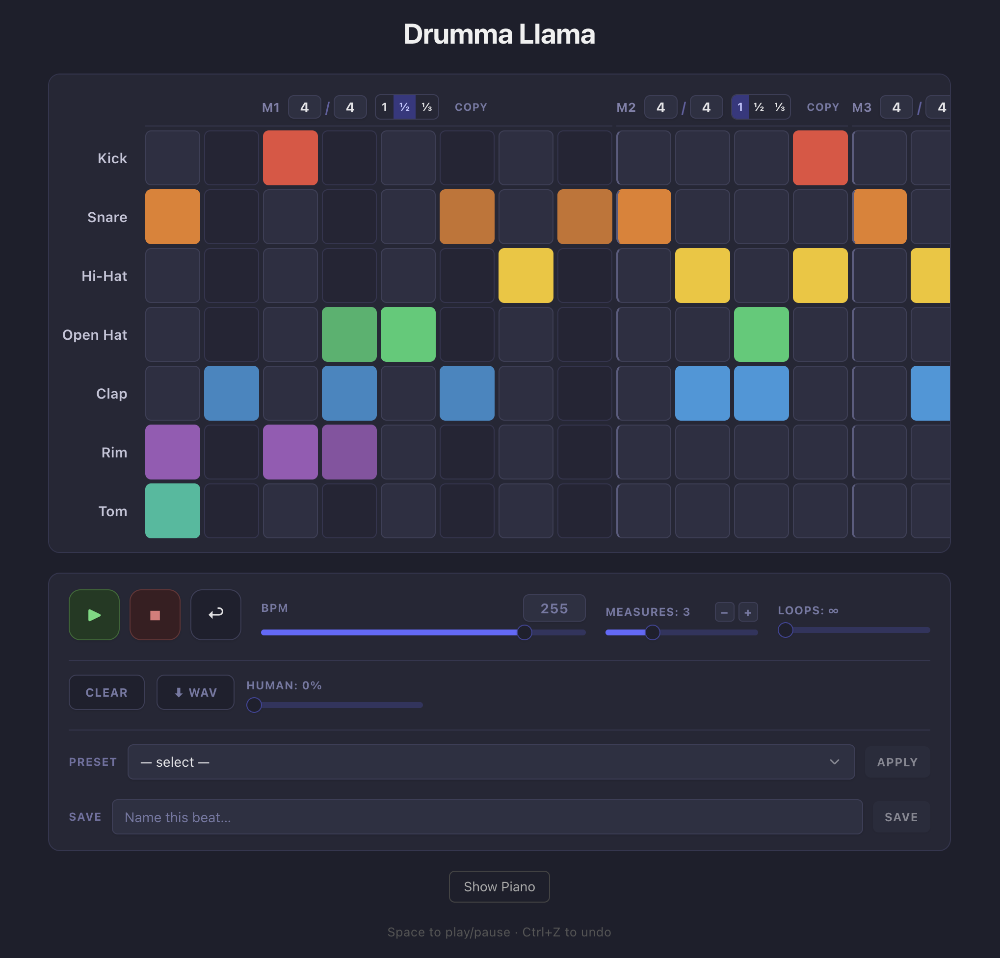

# 🥁 Drumma Llama

[https://drummallama.com/](https://drummallama.com/)

> A step sequencer that really knows how to **hit** it.



Drumma Llama is a browser-based drum machine and step sequencer built with React 19, TypeScript, and the Web Audio API. No plugins, no dependencies on your patience — just beats.

---

## Features

### The Beat Goes On

- **7 instruments** — Kick, Snare, Hi-Hat, Open Hat, Clap, Rim, Tom
- **Step sequencer grid** with 16th-note resolution (fully configurable)
- **Mixed time signatures** — each measure can have its own time sig (3/4, 7/8, 11/16, whatever you can dream up)
- **Live editing during playback** — tweak BPM, toggle beats, and adjust loop count without missing a snare

### Don't Miss a Beat

- **Play / Pause / Stop** transport controls
- **BPM control** — slider for feel, number input for precision (40–300 BPM)
- **Configurable loop count** — or loop infinitely, because some grooves never get old
- **Configurable measure count** — up to 8 measures per loop
- **Space bar** shortcut to play/pause
- **Scroll follows the beat** — the grid auto-scrolls to keep the active step visible

### Preset? I Barely Know It

8 built-in patterns to get you snare-ted:

| Pattern           | Vibe                        |
| ----------------- | --------------------------- |
| Basic Rock        | The one that started it all |
| Four on the Floor | Send it to the dance floor  |
| Hip-Hop           | Boom. Bap.                  |
| Funk              | It'll get you               |
| Reggae            | One drop, no problem        |
| Bossa Nova        | Sophisticated syncopation   |
| Waltz             | Three's company             |
| Shuffle           | The swing's the thing       |

### Save Your Snare-atives

- **Save custom presets** to localStorage — name your masterpiece and bring it back any time
- **User preset library** — your beats survive page reloads, browser restarts, and existential crises
- **Delete presets** you've outgrown

### Measure Up

- **Per-measure time signature editor** — type in any beats/subdivision combination
- **Copy measure** — clone a measure's pattern to any other measure

### Ctrl+Z for the Soul

- **10-step undo history** — because every drummer has at least one fill they regret
- **Ctrl+Z / Cmd+Z** keyboard shortcut

---

## Getting Started

```bash
npm install
npm run dev      # Start development server (Vite + HMR)
```

```bash
npm run build    # Type-check + production build
npm run lint     # Run ESLint
npm run preview  # Preview production build locally
```

---

## Tech Stack

- **React 19** + **TypeScript** + **Vite**
- **Web Audio API** — lookahead scheduler (25ms interval, 100ms lookahead), fire-and-forget synthesis
- **`useReducer`** — all state in one place, pure reducer, no external state library
- **Vanilla CSS** — component-scoped stylesheets, no CSS-in-JS
- **localStorage** — auto-saves your current loop and user presets

---

## Architecture

```
src/
├── App.tsx              # Root: useReducer, undo history, keyboard shortcuts
├── state.ts             # Reducer + Action union (11 actions)
├── types.ts             # AppState, Pattern, LoopConfig, TimeSignature
├── presets.ts           # 8 built-in beat patterns
├── userPresets.ts       # Custom preset persistence (localStorage)
├── constants.ts         # Instruments, defaults, limits
├── audio/
│   ├── AudioEngine.ts   # Web Audio scheduler class
│   └── drumSynths.ts    # Per-instrument synthesis functions
├── hooks/
│   └── useAudioEngine.ts  # React bridge: callbacks → dispatch
└── components/
    ├── DrumGrid/          # Scrollable step sequencer grid
    ├── MeasureHeaders/    # Time signature editors + copy/paste
    ├── InstrumentRow/     # One row per instrument
    ├── BeatCell/          # Individual step button
    └── TransportControls/ # Playback, BPM, presets, undo
```

---

_"In the beginning there was the beat, and it was in 4/4, and it was good."_
